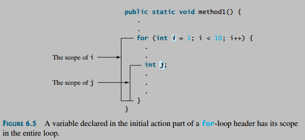

## Notes

#### Scope

* The scope of a variable is the part of the program where the variable can be referenced.

* A variable defined inside a method is referred to as a **local variable**. The scope of a local variable starts from its declaration and continues to the end of the block that contains the variable. A local variable must be declared and assigned a value before it can be used.
* A parameter is actually a local variable. The scope of a method parameter covers the entire method.
* A variable declared in the initial-action part of a for-loop header has its scope in the entire loop. However, a variable declared inside a for-loop body has its scope limited in the loop body from its declaration to the end of the block that contains the variable.

* You can declare a local variable with the same name in different blocks in a method, but you cannot declare a local variable twice in the same block or in nested blocks.

* If a local variable has the same name as a class’s variable, the local variable takes precedence and the class’s variable with the same name is hidden.

* The scope of instance and static variables is the entire class, regardless of where the variables are declared.

#### Access Modifier

   | within class | within package | outside package by subclass only | outside package
  ---|---|---|--|
  private | yes | no | no | no
  default | yes | yes | no | no
  protected | yes | yes | yes | no
  public | yes | yes | yes | yes

* The private modifier applies only to the members of a class.

* The public modifier can apply to a class or members of a class.

* Using the modifiers public and private on local variables would cause a compile error.

* In most cases, the constructor should be public. However, if you want to prohibit the user from creating an instance of a class, use a private constructor.

  For example, there is no reason to create an instance from the Math class, because all of its data fields and methods are static. To prevent the user from creating objects from the Math class, the constructor in java.lang.Math is defined as private.

## Readings

## Problems
