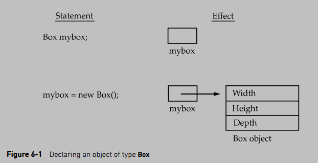

## Notes

#### Object

* An object is a software bundle of variables and related methods.

* An object has a unique identity, state, and behavior.
    1. The state of an object (also known as its properties or attributes) is represented by data fields with their current values.
    2. The behavior of an object (also known as its actions) is defined by methods.

* Obtaining objects of a class is a two-step process:
    1. First, you must declare a variable of the class type. This variable does not define an object. Instead, it is simply a variable that can refer to an object.
    2. Second, you must acquire an actual, physical copy of the object and assign it to that variable. You can do this using the ```new operator```.

    The new operator dynamically allocates (that is, allocates at run time) memory for an object and returns a reference to it. This reference is, more or less, the address in memory of the object allocated by new. This reference is then stored in the variable. Thus, in Java, all class objects must be dynamically allocated. Let’s look at the details of this procedure:

    

* When you assign one object reference variable to another object reference variable, you are not creating a copy of the object, you are only making a copy of the reference.

---

#### Class

* Any concept you wish to implement in a Java program must be encapsulated within a class. Perhaps the most important thing to understand about a class is that it defines a new data type.

* A class can be defined as a template/blueprint that describes the behavior and state of the object of its type support.

* A class has three fundamental building blocks. They are:
    1. Data field
    2. Constructor
    3. Method


* Variables defined within a class are called instance variables because each instance of the class (that is, each object of the class) contains its own copy of these variables.

* For a class to be immutable, it must meet the following requirements:
    1. All data fields must be private.
    2. There can’t be any mutator methods for data fields.
    3. No accessor methods can return a reference to a data field that is mutable.

---

#### UML Notation

Unified Modeling Language (UML) notation is the illustration of class templates and objects. This notation is called a UML class diagram, or simply a class diagram.

In the class diagram, the data field is denoted as
```
dataFieldName: dataFieldType
```
The constructor is denoted as
```
ClassName(parameterName: parameterType)
```
The method is denoted as
```
methodName(parameterName: parameterType): returnType
```


## Readings

* [Definition](https://stackoverflow.com/questions/3686647/whats-the-best-way-to-define-the-words-class-and-object-to-someone-who-hasn)
* [Declaring Class](https://docs.oracle.com/javase/tutorial/java/javaOO/classdecl.html)
* [Java Class & Object](https://www.tutorialspoint.com/java/java_object_classes.htm)
* [Class and Object](http://www.geeksforgeeks.org/classes-objects-java/)


## Problems
