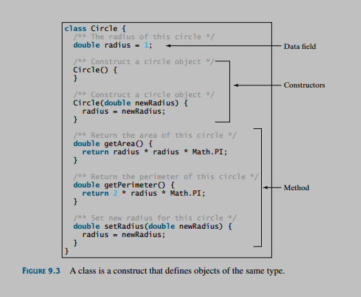
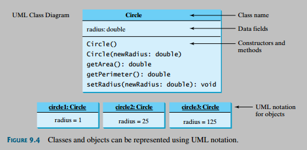

## Notes

#### Object

* An object is a software bundle of variables and related methods.

* An object has a unique identity, state, and behavior.
    1. The state of an object (also known as its properties or attributes) is represented by data fields with their current values.
    2. The behavior of an object (also known as its actions) is defined by methods.

---

#### Class

* A class can be defined as a template/blueprint that describes the behavior and state of the object of its type support.

* A class has three fundamental building blocks. They are:
    1. Data field
    2. Constructor
    3. Method



---

#### UML Notation

Unified Modeling Language (UML) notation is the illustration of class templates and objects. This notation is called a UML class diagram, or simply a class diagram.

In the class diagram, the data field is denoted as
```
dataFieldName: dataFieldType
```
The constructor is denoted as
```
ClassName(parameterName: parameterType)
```
The method is denoted as
```
methodName(parameterName: parameterType): returnType
```




## Readings

* [Definition](https://stackoverflow.com/questions/3686647/whats-the-best-way-to-define-the-words-class-and-object-to-someone-who-hasn)
* [Declaring Class](https://docs.oracle.com/javase/tutorial/java/javaOO/classdecl.html)
* [Java Class & Object](https://www.tutorialspoint.com/java/java_object_classes.htm)
* [Class and Object](http://www.geeksforgeeks.org/classes-objects-java/)


## Problems
