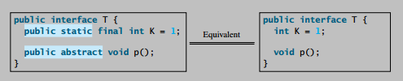

## Notes

* An interface is a class-like construct that contains only constants and abstract methods.

* You can use an interface more or less the same way
you use an abstract class. For example, you can use an interface as a data type for a reference
variable, as the result of casting, and so on. As with an abstract class, you cannot create an
instance from an interface using the new operator.

* A class can implement multiple interfaces, but it can only extend one superclass.

* All variables must be public static final.

* No constructors. An interface cannot be instantiated using the new operator.

* All methods must be public abstract instance methods.

* Class names are nouns. Interface names may be adjectives or nouns.

* Since all data fields are public static final and all methods are public abstract in an interface, Java allows these modifiers to be omitted. Therefore the following interface definitions are equivalent:

    

* Abstract classes and interfaces can both be used to specify common behavior of objects. How do you decide whether to use an interface or a class? In general, a strong is-a relationship that clearly describes a parent-child relationship should be modeled using classes. For example, Gregorian calendar is a calendar, so the relationship between the class java.util.GregorianCalendar and java.util.Calendar is modeled using class inheritance. A weak is-a relationship, also known as an is-kind-of relationship, indicates that an object possesses a certain property. A weak is-a relationship can be modeled using interfaces. For example, all strings are comparable, so the String class implements the Comparable interface.

## Readings

## Problems
